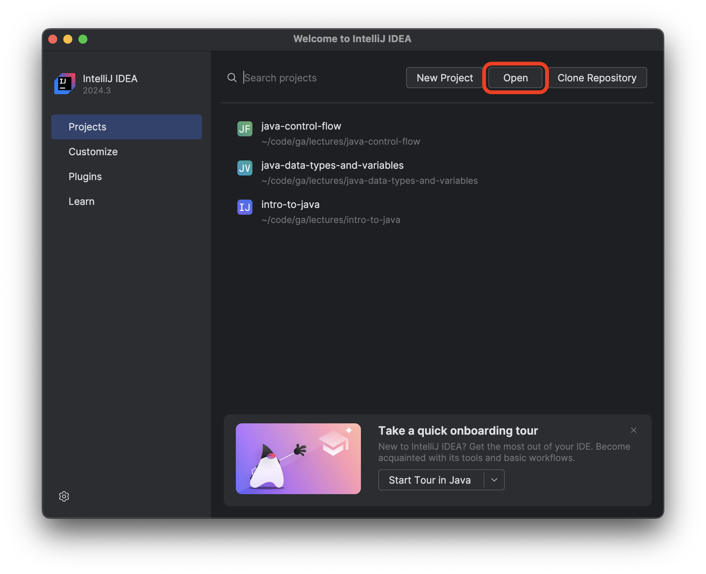
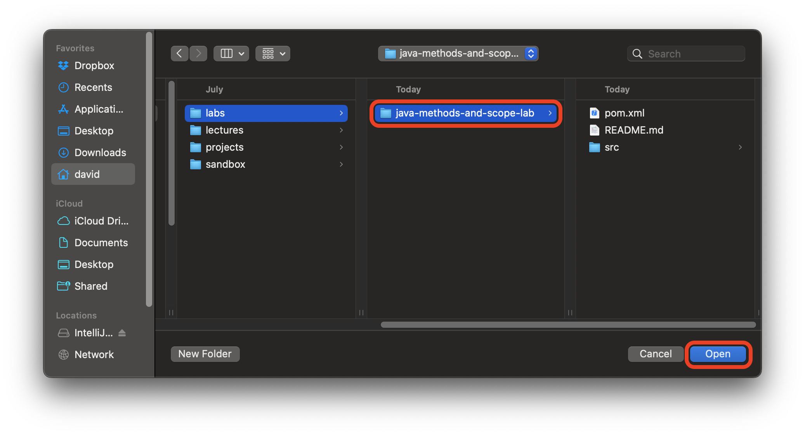

<h1>
  <span class="headline">Java Methods and Scope Lab</span>
  <span class="subhead">Setup</span>
</h1>

## Setup

Open your Terminal application and navigate to a directory of your <code class="filepath">~/code/ga/labs</code> directory.

```bash
cd ~/code/ga/labs
```

Clone the [Java Methods and Scope Lab starter code](https://git.generalassemb.ly/modular-curriculum-all-courses/java-methods-and-scope-lab-starter) repository using the `git clone` command:

```bash
git clone https://git.generalassemb.ly/modular-curriculum-all-courses/java-methods-and-scope-lab-starter java-methods-and-scope-lab
```

> 💡 The `java-methods-and-scope-lab` at the end of this command will place the contents of the `java-methods-and-scope-lab-starter` repo into a directory named <code class="filepath">java-methods-and-scope-lab</code>.

You don't want GA commits on your work, so remove the existing Git information from this starter code:

```bash
rm -rf .git
```

To get this work to GitHub, initialize a new Git repository:

```bash
git init
git add .
git commit -m "initial commit"
```

Make a new repository on your personal GitHub account named `java-methods-and-scope-lab`.

Link your local work to your remote GitHub repo:

```bash
git remote add origin https://github.com/<github-username>/java-methods-and-scope-lab.git
git push origin main
```

<blockquote class="warning">
  🚨 Do not copy the above command. It will not work. Your GitHub username will replace <code>&lt;github-username&gt;</code> (including the <code><</code> and <code>></code>) in the URL above.
</blockquote>

Open IntelliJ IDEA Community Edition and open the project by selecting the `Open` option on the launch screen as outlined in red below.



Next, navigate to the `java-methods-and-scope-lab` directory you just created and open the project.



Trust the project if you are prompted.

## Running the tests

This lab includes a set of tests to help you verify your work. To run the tests, right-click on the <code class="filepath">src/test/java</code> directory and select **Run 'All Tests'**.
